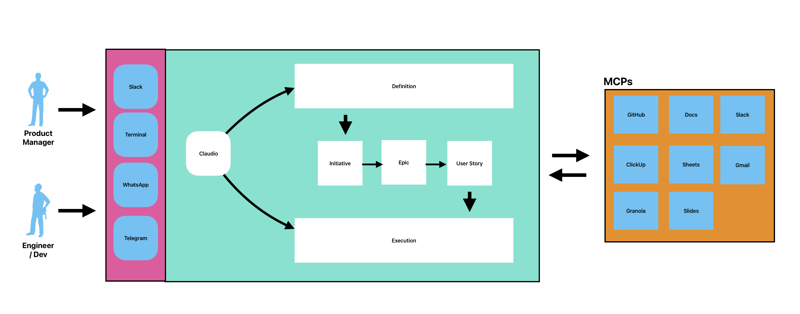

# Claudio

**Productivity assistant for PropHero's Product & Technology team.**

Connects MCPs (ClickUp, GitHub, Slack, Google Docs/Sheets, BigQuery, Granola) to automate product management, development, and communication tasks. Available via Terminal, Slack, Telegram, and Web.



---

## Quick Start

### Prerequisites

- Python 3.10+, Node.js 18+
- [Claude Code CLI](https://docs.anthropic.com/en/docs/claude-code) (for bots and scripts)
- Cursor IDE (for direct usage)

### Setup

```bash
git clone <repo-url> claudio && cd claudio
python3 -m venv venv && source venv/bin/activate
pip install -r requirements.txt
cp .env.example .env  # fill in your values
```

### Usage with Cursor (recommended)

1. Open the project in Cursor
2. Set up MCPs using `mcp/cursor-config.json` as reference for `~/.cursor/mcp.json`
3. Restart Cursor — ready to go

### Channels

| Channel | Start | Docs |
|---------|-------|------|
| **Telegram** | `./channels/telegram/start.sh` | [README](./channels/telegram/README.md) |
| **Slack** | `./channels/slack/start.sh` | [README](./channels/slack/README.md) |
| **Web Dashboard** | `./channels/web/start.sh` → `localhost:8000` | [README](./channels/web/README.md) |

Each channel has its own `requirements.txt` — install before starting.

---

## Scripts

Automated cron jobs that run Claude Code CLI with specific prompts and MCP access.

| Script | Schedule | What it does |
|--------|----------|--------------|
| [`weekly-bot-report.sh`](./scripts/weekly-bot-report.sh) | Mondays 9 AM | Pulls bot metrics from Google Sheets and emails a WoW performance report |
| [`monthly-ds-ai-report.sh`](./scripts/monthly-ds-ai-report.sh) | 1st of month 10 AM | Generates DS & AI squad monthly review from ClickUp → Google Doc |
| [`kill_bot_processes.sh`](./scripts/kill_bot_processes.sh) | Manual | Kills all running bot processes and cleans up lock files |

Logs go to `scripts/logs/`. To set up cron:

```bash
crontab -e
# Weekly bot report — every Monday at 9 AM
0 9 * * 1 /path/to/claudio/scripts/weekly-bot-report.sh
# Monthly DS&AI report — 1st of each month at 10 AM
0 10 1 * * /path/to/claudio/scripts/monthly-ds-ai-report.sh
```

---

## Project Structure

```
claudio/
├── CLAUDE.md                          # Identity and instructions
├── README.md                          # This file
├── requirements.txt                   # Python dependencies
├── .env.example                       # Environment variables template
│
├── docs/                              # Brain — documentation and guides
│   ├── README.md                      # Docs index
│   ├── INITIATIVE_CLAUDIO.md          # Project initiative definition
│   ├── images/                        # Assets (architecture diagram)
│   ├── design-system/                 # PropHero design system reference
│   │   └── reference.md
│   ├── integrations/                  # Guide per MCP
│   │   ├── terminal.md
│   │   ├── clickup/                   # config, guide, templates (initiative, epic, user-story)
│   │   ├── github/
│   │   ├── google-docs/
│   │   ├── google-sheets/
│   │   ├── granola/
│   │   └── slack/
│   └── workflows/                     # Multi-MCP workflows
│       ├── weekly-bot-report.md       # Cron-based workflows
│       ├── monthly-ds-ai-report.md
│       ├── product/                   # daily-standup, create-initiative, sprint-report
│       └── revenue/                   # funnel-master, hook-script-creator
│
├── mcp/                               # Hands — MCP configuration
│   ├── cursor-config.json             # MCP config for Cursor IDE
│   ├── claude-code-config.example.json
│   └── servers/                       # Server-specific docs
│
├── channels/                          # Mouths — interfaces
│   ├── telegram/                      # bot.py, start.sh, requirements.txt
│   ├── slack/                         # bot.py, start.sh, requirements.txt
│   └── web/                           # FastAPI dashboard + chat
│       ├── app.py
│       ├── start.sh
│       └── templates/                 # dashboard.html, chat.html
│
└── scripts/                           # Automated cron jobs
    ├── weekly-bot-report.sh
    ├── monthly-ds-ai-report.sh
    ├── kill_bot_processes.sh
    └── logs/                          # Script execution logs
```

---

## Workflows

| Workflow | MCPs | Trigger |
|----------|------|---------|
| [Daily Standup](./docs/workflows/product/daily-standup.md) | Slack + Docs | "Create daily notes" |
| [Create Initiative](./docs/workflows/product/create-initiative.md) | ClickUp + Docs | "Create an initiative for X" |
| [Sprint Report](./docs/workflows/product/sprint-report.md) | ClickUp + Slack + Sheets | "Generate the sprint report" |
| [Weekly Bot Report](./docs/workflows/weekly-bot-report.md) | Sheets + Gmail | Cron: Monday 9 AM |
| [Monthly DS&AI Report](./docs/workflows/monthly-ds-ai-report.md) | ClickUp + Docs | Cron: 1st of month |
| [Funnel Master](./docs/workflows/revenue/funnel-master.md) | Sheets + BigQuery | "Analyze the funnel" |
| [Hook Script Creator](./docs/workflows/revenue/hook-script-creator-v3.md) | Docs | "Create hook scripts" |

---

## Contributing

### Add an MCP

1. Add config to `mcp/cursor-config.json`
2. Create guide at `docs/integrations/{name}/guide.md`
3. Update `CLAUDE.md`

### Add a workflow

1. Create `.md` in `docs/workflows/{area}/`
2. If it needs cron, add a script to `scripts/`

### Add a channel

1. Create `channels/{name}/` with `bot.py`, `requirements.txt`, `start.sh`, `.env.example`
2. Document in `channels/{name}/README.md`

### Add a script

1. Create `.sh` in `scripts/` following the existing pattern (set -e, logging, Claude CLI call)
2. Add cron entry and document in the workflow `.md`

### Periodic maintenance

- **Every quarter**: update Epics list ID in [`docs/integrations/clickup/config.md`](./docs/integrations/clickup/config.md)
- **MCP changes**: update guide and configs in `mcp/`
- **Behavior changes**: update `CLAUDE.md`

---

*Claudio — Built with Claude for PropHero's P&T team.*
